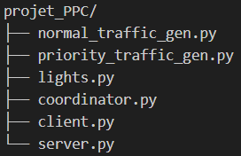
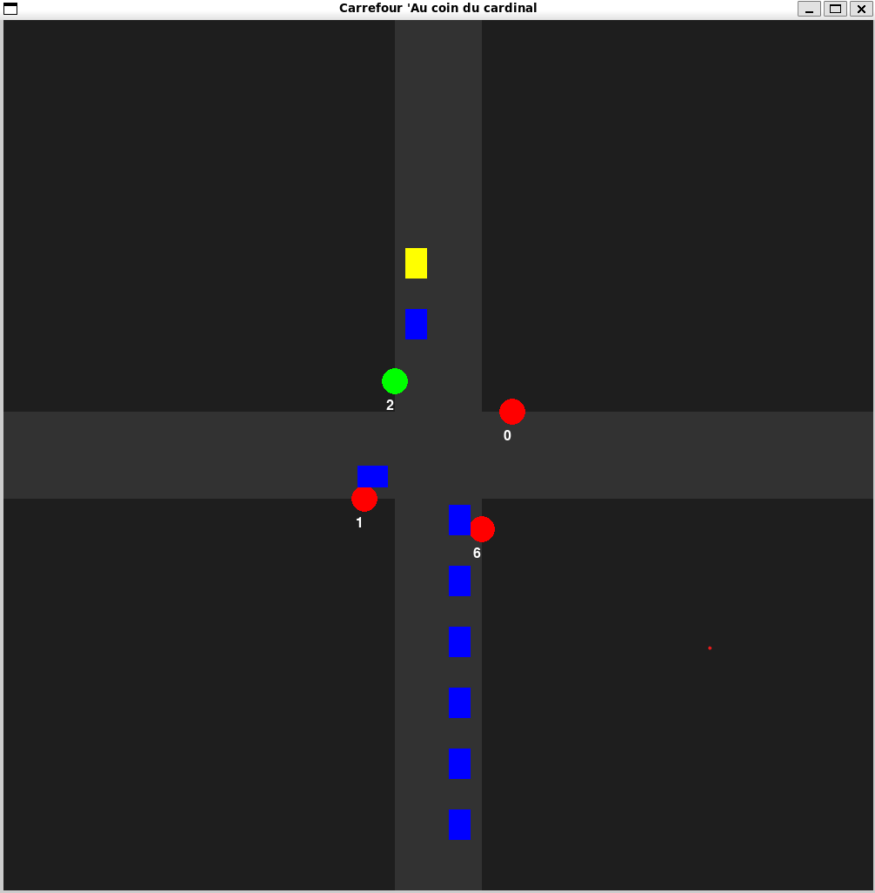

# PPC Project: At the Crossroads

Jean-Baptiste SIMON / Hugo NOEL

## Objectifs du projet

Ce projet a été développé dans le cadre du cours de Programmation Parallèle et Concurrente.

L'objectif principal est de modéliser et de gérer le flux de véhicules normaux et prioritaires à une intersection en utilisant des techniques de programmation parallèle et concurrente.

La simulation permet de visualiser en temps réel l'état des feux de circulation, le nombre de véhicules en attente dans chaque direction, et de s'assurer que les véhicules prioritaires peuvent traverser l'intersection en toute sécurité.

## Fonctionnement du code

### Structure du projet

Le projet est structuré en plusieurs modules, chacun ayant une responsabilité spécifique :

- **normal_traffic_gen.py** : Génère le trafic de véhicules normaux à des intervalles aléatoires. Chaque véhicule a une source et une destination aléatoires.
- **priority_traffic_gen.py** : Génère le trafic de véhicules prioritaires à des intervalles aléatoires. Chaque véhicule a une source et une destination aléatoires et déclenche un signal pour changer les feux de circulation afin de permettre son passage rapide.
- **lights.py** : Gère les feux de circulation. Il change les feux à intervalles réguliers en mode normal et répond aux signaux des véhicules prioritaires pour ajuster les feux en conséquence.
- **coordinator.py** : Gère le passage des véhicules à l'intersection en fonction de l'état des feux de circulation. Il vérifie les files d'attente des véhicules et permet leur passage lorsque les feux sont verts.
- **server.py** : Démarre un serveur qui accepte les connexions des clients et diffuse les mises à jour de l'état de l'intersection à tous les clients connectés. Il gère également la génération du trafic normal et prioritaire, ainsi que la gestion des feux de circulation et la coordination des véhicules.
- **client.py** : Se connecte au serveur pour recevoir les informations sur l'état de l'intersection et les affiche en temps réel à l'aide de Pygame. Il dessine les routes, les feux de circulation et les véhicules.

    

### Communication inter-processus

- **Queues** : Utilisées pour stocker les véhicules en attente de traverser l'intersection. Il y a une file d'attente pour chaque direction (nord, sud, est, ouest).
- **Shared Memory** : Utilisée pour stocker l'état des feux de circulation, le nombre de véhicules dans chaque direction et les informations de chaque véhicule dans le carrefour.
- **Signals** : Utilisés pour indiquer la présence puis le passage de véhicules prioritaires sur les différentes directions de l’intersection.
- **Sockets** : Utilisés pour la communication entre le serveur, qui fait tourner la simulation et les clients, qui l'affiche.

## Lancement du projet

### Prérequis

Assurez-vous d'avoir Python et les bibliothèques nécessaires installées :

- `multiprocessing`
- `threading`
- `socket`
- `signal`
- `pygame`
- `time`
- `json`
- `os`

### Étapes de lancement

1. **Démarrer le serveur** :
   Ouvrez un terminal et exécutez la commande suivante :

   ```sh
   python server.py
   ```

2. **Démarrer le client** :
    Ouvrez un autre terminal et exécutez la commande suivante :

    ```sh
   python client.py
   ```

    

3. Observer la simulation :
    Le client se connectera au serveur et affichera la simulation en temps réel à l'aide de Pygame.
